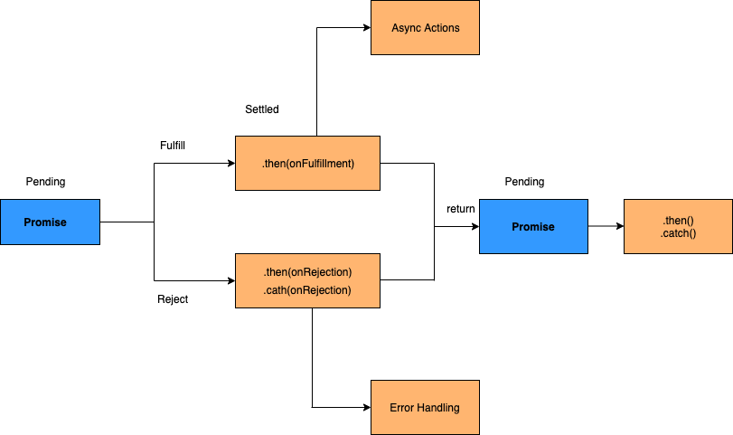

# JS Interview Questions & Answers

JS Interview Questions is a guide for both interviewers and candidates to prepare for JS interviews. It features a curated list of questions covering basic to advanced concepts, helping evaluate understanding and skills in JS related framework development. Ideal for interview preparation or enhancing JS knowledge.

⭐ If you find this guide helpful, please star the repository to show your support and help others discover it.

---

| 1.  | What are the different data types present in javascript? |
| --- | :------------------------------------------------------- |

we can use the typeof operator to know the data type of the variable.

> Primitive types

1. String

```
var str = "Vivek Singh Bisht";
var str2 = 'John Doe';
```

2. Number

```javascript
var x = 3;
var y = 3.6;
```

3. BigInt

```javascript
var bigInteger = 234567890123456789012345678901234567890;
```

4. Boolean

```
var a = 2;
var b =  3;
var c =  2;
(a == b) // returns false
(a == c) // returns true
```

5. Undefined

```javascript
var x; // value of x is undefined
var y = undefined; // we can also set the value of a variable as undefined
```

6. Null

```javascript
var z = null;
```

7. Symbol : It is a new data type introduced in the ES6 version of javascript. It is used to store an anonymous and unique value.

```
var symbol1 = Symbol('symbol');
```

> Exception

```javascript
typeof null; // Returns "object" (kind of a bug in JavaScript)
```

> Non-primitive types

Primitive data types can store only a single value. To store multiple and complex values, non-primitive data types are used.

1. Object

```javascript
var obj1 = {
  x: 43,
  y: "Hello world!",
  z: function () {
    return this.x;
  },
};
```

2. Object

```javascript
var array1 = [5, "Hello", true, 4.1];
```

<br />

| 2.  | Hoisting in javascript? |
| --- | :---------------------- |

Hoisting is the default behaviour of javascript where all the variable and function declarations are moved on top.


<br />

| 3.  | Why do we use the word “debugger” in javascript? |
| --- | :----------------------------------------------- |

The debugger for the browser must be activated in order to debug the code. The remaining section of the code should stop execution before moving on to the next line while debugging.

<br />

| 4.  | Difference between “ == “ and “ === “ operators. |
| --- | :----------------------------------------------- |

Both are comparison operators. The difference between both the operators is that “==” is used to compares values for equality with type coercion whereas, “===” is used to compares values and types for strict equality without type coercion.

```javascript
0 == false   // true
0 === false  // false
1 == "1"     // true
1 === "1"    // false
null == undefined // true
null === undefined // false
'0' == false // true
'0' === false // false
NaN == NaN or NaN === NaN // false
[]==[] or []===[] //false, refer different objects in memory
{}=={} or {}==={} //false, refer different objects in memory
```

<br />

| 5.  | Difference between var and let keyword in javascript. |
| --- | :---------------------------------------------------- |

| **const**                                     | **var**                                                        | **let**                                       |
| --------------------------------------------- | -------------------------------------------------------------- | --------------------------------------------- |
| It has block scope                            | It has function scope                                          | It has block scope                            |
| It is not possible to re-declare the variable | It is possible to re-declare the variable in the same scope    | It is not possible to re-declare the variable |
| Hoisted but not initialized                   | Variable declaration will be hoisted, initialized as undefined | Hoisted but not initialized                   |

```js
Example with var:

console.log(a); // Outputs: undefined (hoisted and initialized)
var a = 10;
console.log(a); // Outputs: 10

Example with let:

console.log(b); // ReferenceError: Cannot access 'b' before initialization
let b = 10;
console.log(b); // Outputs: 10\
```

<br />

| 6.  | Implicit Type Coercion in javascript. |
| --- | :------------------------------------ |

Implicit type coercion in javascript is the automatic conversion of value from one data type to another.

- String coercion

```javascript
var x = 24;
var y = "Hello";
x + y; // Returns "24Hello";
```

```javascript
var x = 3;
Var y = "3";
x - y  //Returns 0 since the variable y (string type) is converted to a number type
```

- Boolean Coercion

`Note`: All values except false, 0, 0n, -0, “”, null, undefined, and NaN are truthy values.

````javascript
var x = 0;
var y = 23;

if (x) {
  console.log(x);
} // The code inside this block will not run since the value of x is 0(Falsy)

if (y) {
  console.log(y);
} // The code inside this block will run since the value of y is 23 (Truthy)```
````

- Logical operators:

`OR ( | | ) operator` - If the first value is truthy, then the first value is returned. Otherwise, always the second value gets returned.

`AND ( && ) operator` - If both the values are truthy, always the second value is returned. If the first value is falsy then the first value is returned or if the second value is falsy then the second value is returned.

<br />

| 7.  | What is NaN property in JavaScript? |
| --- | :---------------------------------- |

NaN property represents the “Not-a-Number” value. It indicates a value that is not a legal number.

typeof of NaN will return a Number.

```javascript
isNaN("Hello"); // Returns true
isNaN(345); // Returns false
isNaN("1"); // Returns false, since '1' is converted to Number type which results in 0 ( a number)
isNaN(true); // Returns false, since true converted to Number type results in 1 ( a number)
isNaN(false); // Returns false
isNaN(undefined); // Returns true
```

<br />

| 8.  | Is javascript a statically typed or a dynamically typed language? |
| --- | :---------------------------------------------------------------- |

JavaScript is a `dynamically typed language`. In a dynamically typed language, the type of a variable is checked during `run-time` in contrast to a statically typed language, where the type of a variable is checked during `compile-time`.

<br />

| 9.  | Explain passed by value and passed by reference? |
| --- | :----------------------------------------------- |

- Passed by Value

When passing primitive types to a function, JavaScript uses pass-by-value. This means a copy of the value is passed to the function, and any modifications within the function do not affect the original value outside the function.

ex.

```javascript
function modifyValue(x) {
  x = 10; // This change is local to the function
}

let a = 5;
modifyValue(a);
console.log(a); // Output will be 5
```

- Passed by Reference

When passing objects/array to a function, JavaScript uses pass-by-reference. This means a reference to the original object is passed to the function, and modifications to the object within the function will affect the original object.

```javascript
function modifyObject(obj) {
  obj.value = 10; // This change affects the original object
}

let myObject = { value: 5 };
modifyObject(myObject);
console.log(myObject.value); // Output will be 10
```

`Important Note`:

```javascript
function reassignObject(obj) {
  obj = { value: 10 }; // This reassignment does not affect the original object
}

let myObject = { value: 5 };
reassignObject(myObject);
console.log(myObject.value); // Output will still be 5
```

<br />

| 10. | Immediately Invoked Function Execution(IIFE or IIFY) OR Self-Invoking Functions? |
| --- | :------------------------------------------------------------------------------- |

is a function that runs as soon as it is defined.

```javascript
(function () {
  // Do something;
})();
```

1. With Parameters:

```javascript
(function (message) {
  console.log(message);
})("Hello, IIFE!"); // Output: Hello, IIFE!
```

2. Using Arrow Functions:

```javascript
(() => {
  console.log("IIFE with arrow function");
})();
```

- Use Cases of IIFE

1. Avoiding Global Variables:

```javascript
(function () {
  var privateVariable = "I am private";
  console.log(privateVariable);
})();

console.log(typeof privateVariable); // Output: undefined
```

2. Module Pattern:

```javascript
var module = (function () {
  var privateVariable = "I am private";

  function privateMethod() {
    console.log(privateVariable);
  }

  return {
    publicMethod: function () {
      privateMethod();
    },
  };
})();

module.publicMethod(); // Output: I am private
console.log(typeof module.privateVariable); // Output: undefined
```

<br />

| 11. | strict mode in javascript? |
| --- | :------------------------- |

Strict mode is useful to write "secure" JavaScript by notifying "bad syntax" into real errors.
instructs the browser to use the javascript code in the Strict mode.

```javascript
"use strict";
x = 3.14; // This will cause an error because x is not declared
```

```javascript
x = 3.14; // This will not cause an error.
myFunction();

function myFunction() {
  "use strict";
  y = 3.14; // This will cause an error
}
```

<br />

| 12. | What is a first class function? |
| --- | ------------------------------- |

A first-class function is a function that can be treated like any other variabl. This means that functions can be assigned to any other variable or passed as an argument or can be returned by another function or stored in data structures.

```js
// Assigning a function to a variable
const greet = function (name) {
  return `Hello, ${name}!`;
};

// Passing a function as an argument
function sayHello(fn, name) {
  console.log(fn(name));
}

sayHello(greet, "Alice"); // Outputs: Hello, Alice!

// Returning a function from another function
function createGreeting(greeting) {
  return function (name) {
    return `${greeting}, ${name}!`;
  };
}

const sayHi = createGreeting("Hi");
console.log(sayHi("Bob")); // Outputs: Hi, Bob!

// Storing functions in an array
const functionsArray = [greet, sayHi];
console.log(functionsArray[0]("Charlie")); // Outputs: Hello, Charlie!
console.log(functionsArray[1]("Dave")); // Outputs: Hi, Dave!
```

<br />

| 13. | What is a first order function? |
| --- | ------------------------------- |

A first-order function is a function that does not take any other functions as arguments and does not return a function as its result. First-order functions perform simple tasks such as mathematical operations, data manipulation, or string processing.

<br/>

| 14. | Higher Order Functions? |
| --- | :---------------------- |

Functions that operate on other functions, either by taking them as arguments or by returning them, are called higher-order functions.

ex.
With array : map(), reduce(), filter(), and sort()
With object : Object.entries()
With functions : compose()
setTimeout(), setInterval() etc...

<br />

`Note`: A first-order function is a function that does not take any other functions as arguments and does not return a function as its result. In contrast to higher-order functions, which either take functions as parameters or return functions, first-order functions deal only with basic data types or objects.

<br />

| 15. | What is a unary function? |
| --- | ------------------------- |

A unary function (i.e. monadic) is a function that accepts exactly one argument. It stands for a single argument accepted by a function.

```js
const unaryFunction = (a) => console.log(a + 10); // Add 10 to the given argument and display the value
```

| 16. | What is a pure function? |
| --- | ------------------------ |

A pure function always produces the same output for the same inputs and has no side effects.

```js
// Pure function: adds two numbers
function add(a, b) {
  return a + b;
}

// Example usage
console.log(add(2, 3)); // Outputs: 5
console.log(add(2, 3)); // Always outputs: 5 (deterministic)
```

ImPure function

```js
let counter = 0;

// Impure function: modifies external state
function increment() {
  counter += 1;
  return counter;
}

// Example usage
console.log(increment()); // Outputs: 1
console.log(increment()); // Outputs: 2 (different output for the same input)
```

<br />

| 17. | Explain “this” keyword. |
| --- | :---------------------- |

the `this` keyword refers to an object that is currently executing or calling the function.

```javascript
function myFunction() {
  return this;
}

console.log(myFunction());
```

<br />

| 18. | Explain call(), apply() and, bind(). |
| --- | :----------------------------------- |

- `call()`:

The `call()` method calls a function with a given this value and arguments provided individually.

```javascript

functionName.call(thisArg, arg1, arg2, ...);
-------------------------------------------------------------
Ex: 1

function sayHello() {
  return "Hello " + this.name;
}

var obj = { name: "Jimmy" };

sayHello.call(obj); // Returns "Hello Jimmy"
-------------------------------------------------------------
Ex: 2

var person = {
  age: 23,
  getAge: function () {
    return this.age;
  },
};
var person2 = { age: 22 };
person.getAge.call(person2); // Returns 22
-------------------------------------------------------------
Ex: 3

function greet(greeting, punctuation) {
  console.log(greeting + ", " + this.name + punctuation);
}

const person = { name: "Jimmy" };

greet.call(person, "Hello", "!"); // Output: Hello, Jimmy!
```

- `apply()`:

The apply method is similar to the call() method. The only difference is that, call() method takes arguments separately whereas, apply() method takes arguments as an array.

```javascript
functionName.apply(thisArg, [argsArray]);
-------------------------------------------------------------
EX: 1

function greet(greeting, punctuation) {
  console.log(greeting + ', ' + this.name + punctuation);
}

const person = { name: 'Jimmy' };

greet.apply(person, ['Hi', '!']); // Output: Hi, Jimmy!
```

- `bind()`:

The bind() method in JavaScript is used to create a new function that, when called, has its this keyword set to a specified value. Additionally, you can pre-set arguments for this new function.

```javascript
const boundFunction = functionName.bind(thisArg, arg1, arg2, ...);-------------------------------------------------------------
Ex: 1

function greet(greeting, punctuation) {
  console.log(greeting + ', ' + this.name + punctuation);
}

const person = { name: 'Jimmy' };

const boundGreet = greet.bind(person, 'Hey');
boundGreet('!'); // Output: Hey, Jimmy!
```

<br />

| 19. | Difference between exec() and test() methods. |
| --- | :-------------------------------------------- |

`exce()` : To search for a pattern in a string and return the matched results in array form if contains otherwise return null.

```javascript
const regex = /hello/;
const str = "hello world";

console.log(regex.exec(str)); // Output: ["hello"]
```

`test()` : To test whether a pattern exists in a string. return a boolean value.

```javascript
const regex = /hello/;
const str = "hello world";

console.log(regex.test(str)); // Output: true
```

<br />

| 20. | What is currying in JavaScript? |
| --- | :------------------------------ |

Currying is a technique where a function is transformed into a sequence of functions, each taking a single argument.

```javascript

Original Function
function add(a, b, c) {
  return a + b + c;
}

const result = add(1,2,3);
console.log(result);// Output: 6s

        ⏬

Curried Function
function curryAdd(a) {
  return function(b) {
    return function(c) {
      return a + b + c;
    };
  };
}
const result = curryAdd(1)(2)(3);
console.log(result); // Output: 6s
```

<br />

| 21. | What is the difference between slice and splice? |
| --- | :----------------------------------------------- |

Slice:
The slice() method returns the selected elements in an array as a new array object.
( It selects the elements starting at the given start argument, and ends at the given optional end argument without including the last element.)

Splice:
The splice() method adds/removes items to/from an array, and then returns the removed item.
(The first argument specifies the array position/index for insertion or deletion whereas the optional second argument indicates the number of elements to be deleted. Each additional argument is added to the array.)

|     | **slice**                                    | **splice**                                   |
| --- | -------------------------------------------- | -------------------------------------------- |
| 1.  | Doesn't modify the original array(immutable) | Modifies the original array(mutable)         |
| 2.  | Returns the subset of original array         | Returns the deleted elements as array        |
| 3.  | Used to select the elements from array       | Used to insert/delete elements to/from array |

```javascript
Slice Ex.

let arrayIntegers = [1, 2, 3, 4, 5];
let arrayIntegers1 = arrayIntegers.slice(0, 2); // returns [1,2]
let arrayIntegers2 = arrayIntegers.slice(2, 3); // returns [3]
let arrayIntegers3 = arrayIntegers.slice(4); // returns [5]
let arrayIntegers4 = arrayIntegers.slice(-3, -1); // returns [3, 4]
```

```javascript
Splice Ex.

let arrayIntegersOriginal1 = [1, 2, 3, 4, 5];
let arrayIntegersOriginal2 = [1, 2, 3, 4, 5];
let arrayIntegersOriginal3 = [1, 2, 3, 4, 5];

let arrayIntegers1 = arrayIntegersOriginal1.splice(0, 2); // returns [1, 2]; original array: [3, 4, 5]
let arrayIntegers2 = arrayIntegersOriginal2.splice(3); // returns [4, 5]; original array: [1, 2, 3]
let arrayIntegers3 = arrayIntegersOriginal3.splice(3, 1, "a", "b", "c"); //returns [4]; original array: [1, 2, 3, "a", "b", "c", 5]
```

<br />

| 22. | What are Lambda Expressions/Arrow functions? |
| --- | -------------------------------------------- |

lambda expressions are known as arrow functions. They provide a concise syntax for writing function expressions.

```javascript
const add = function(a, b) {
  return a + b;
};
        ⏬
const add = (a, b) => a + b;
```

<br />

| 23. | Explain Scope and Scope Chain in javascript. |
| --- | -------------------------------------------- |

Scope in JS determines the accessibility of variables and functions.

There are three types of scopes in JS:

1. Global Scope
2. Local or Function Scope
3. Block Scope

> Global Scope :

```javascript
var globalVariable = "Hello world";

function sendMessage() {
  return globalVariable; // can access globalVariable since it's written in global space
}
function sendMessage2() {
  return sendMessage(); // Can access sendMessage function since it's written in global space
}
sendMessage2(); // Returns “Hello world”
```

> Local or Function Scope :

```javascript
function awesomeFunction() {
  var a = 2;

  var multiplyBy2 = function () {
    console.log(a * 2); // Can access variable "a" since a and multiplyBy2 both are written inside the same function
  };
}
console.log(a); // Throws reference error since a is written in local scope and cannot be accessed outside

multiplyBy2(); // Throws reference error since multiplyBy2 is written in local scope
```

> Block Scope :

```javascript
{
  let x = 45;
}

console.log(x); // Gives reference error since x cannot be accessed outside of the block

for (let i = 0; i < 2; i++) {
  // do something
}

console.log(i); // Gives reference error since i cannot be accessed outside of the for loop block
```

**Scope Chain**

As you can see in the code above, if the javascript engine does not find the variable in local scope, it tries to check for the variable in the outer scope. If the variable does not exist in the outer scope, it tries to find the variable in the global scope.

```javascript
var y = 24;

function favFunction() {
  var x = 667;
  var anotherFavFunction = function () {
    console.log(x); // Does not find x inside anotherFavFunction, so looks for variable inside favFunction, outputs 667
  };

  var yetAnotherFavFunction = function () {
    console.log(y); // Does not find y inside yetAnotherFavFunction, so looks for variable inside favFunction and does not find it, so looks for variable in global scope, finds it and outputs 24
  };

  anotherFavFunction();
  yetAnotherFavFunction();
}
favFunction();
```

<br />

| 24. | Explain Closures. |
| --- | ----------------- |

A closure gives you access to an outer function's scope from an inner function.

```javascript
function randomFunc() {
  var obj = { name: "Jimmy", age: 21 };

  return function () {
    console.log(obj.name + " is " + "awesome"); // Has access to obj1 even when the randomFunc function is executed
  };
}

var initialiseClosure = randomFunc(); // Returns a function

initialiseClosure();
```

<br />

| 25. | What are callback function? |
| --- | --------------------------- |

A callback function is a function passed into another function as an argument. This function is invoked inside the outer function to complete an action.

```javascript
function callbackFunction(name) {
  console.log("Hello " + name);
}

function outerFunction(callback) {
  let name = prompt("Please enter your name.");
  callback(name);
}

outerFunction(callbackFunction);
```

<br />

| 26. | Why do we need callbacks? |
| --- | ------------------------- |

The callbacks are needed because javascript is an event driven language. That means instead of waiting for a response javascript will keep executing while listening for other events.

```javascript
function firstFunction() {
  // Simulate a code delay
  setTimeout(function () {
    console.log("First function called");
  }, 1000);
}
function secondFunction() {
  console.log("Second function called");
}
firstFunction();
secondFunction();

Output;
// Second function called
// First function called
```

<br />

| 27. | What is a callback hell? |
| --- | ------------------------ |

Callback Hell is an anti-pattern with multiple nested callbacks which makes code hard to read and debug when dealing with asynchronous logic. The callback hell looks like below,

```javascript
async1(function(){
    async2(function(){
        async3(function(){
            async4(function(){
                ....
            });
        });
    });
});
```

<br />

| 28. | What is memoization? |
| --- | -------------------- |

Memoization is a functional programming technique which attempts to increase a function’s performance by caching its previously computed results. Each time a memoized function is called, its parameters are used to index the cache. If the data is present, then it can be returned, without executing the entire function. Otherwise the function is executed and then the result is added to the cache. Let's take an example of adding function with memoization,

```javascript
const memoizAddition = () => {
  let cache = {};
  return (value) => {
    console.log(cache);
    if (value in cache) {
      console.log("Fetching from cache");
      return cache[value]; // Here, cache.value cannot be used as property name starts with the number which is not a valid JavaScript  identifier. Hence, can only be accessed using the square bracket notation.
    } else {
      console.log("Calculating result");
      let result = value + 20;
      cache[value] = result;
      return result;
    }
  };
};
// returned function from memoizAddition
const addition = memoizAddition();
console.log(addition(20)); //output: 40 calculated
console.log(addition(20)); //output: 40 cached
```

<br />

| 29. | What is recursion? |
| --- | ------------------ |

function call itself repeatedly until it arrives at a result.

```javascript
function add(number) {
  if (number <= 0) {
    return 0;
  } else {
    return number + add(number - 1);
  }
}
add(3) => 3 + add(2)
          3 + 2 + add(1)
          3 + 2 + 1 + add(0)
          3 + 2 + 1 + 0 = 6
```

<br />

| 30. | What are the possible ways to create objects in JavaScript? |
| --- | ----------------------------------------------------------- |

1. Object literal syntax:

```js
var object = {
  name: "Jimmy",
  age: 21,
};
```

2. Object constructor:

The simplest way to create an empty `object` is using the Object constructor. Currently this approach is not recommended.

```js
var object = new Object();
```

The `Object()` is a built-in constructor function so "new" keyword is not required. The above code snippet can be re-written as:

```js
var object = Object();
```

3. Object's create method:

The following code creates a new empty object whose prototype is null.

```js
var object = Object.create(null);
```

The following example creates an object along with additional new properties.

```js
let vehicle = {
  wheels: "4",
  fuelType: "Gasoline",
  color: "Green",
};
let carProps = {
  type: {
    value: "Volkswagen",
  },
  model: {
    value: "Golf",
  },
};

var car = Object.create(vehicle, carProps);
console.log(car);
```

4. Function constructor:

```js
function Person(name) {
  this.name = name;
  this.age = 21;
}
var object = new Person("Jimmy");
```

5. Function constructor with prototype:

This is similar to function constructor but it uses prototype for their properties and methods,

```js
function Person() {}
Person.prototype.name = "Jimmy";
var object = new Person();
```

6. Object's assign method:

The `Object.assign` method is used to copy all the properties from one or more source objects and stores them into a target object.

```js
const orgObject = { company: "XYZ Corp" };
const carObject = { name: "Toyota" };
const staff = Object.assign({}, orgObject, carObject);
```

7. ES6 Class syntax:

```js
class Person {
  constructor(name) {
    this.name = name;
  }
}

var object = new Person("Jimmy");
```

8. Singleton pattern:

```js
var object = new (function () {
  this.name = "Jimmy";
})();
```

<br />

| 31. | What are arrow functions? |
| --- | ------------------------- |

Arrow functions were introduced in the ES6 version of javascript. An arrow function is a shorter/concise syntax for a function expression .

```js
// Traditional Function Expression
var add = function (a, b) {
  return a + b;
};

// Arrow Function Expression
var arrowAdd = (a, b) => a + b;

const arrowFunc1 = (a, b) => a + b; // Multiple parameters
const arrowFunc2 = (a) => a * 10; // Single parameter
const arrowFunc3 = () => {}; // no parameters
```

<br />

| 32. | What is Temporal Dead Zone(TDZ)? |
| --- | -------------------------------- |

The Temporal Dead Zone(TDZ) is a specific period or area of a block where a variable is inaccessible until it has been intialized with a value.

```js
function somemethod() {
  console.log(counter1); // undefined
  console.log(counter2); // ReferenceError
  var counter1 = 1;
  let counter2 = 2;
}
```

<br />

| 33. | What are classes in ES6? |
| --- | ------------------------ |

```js
function Bike(model, color) {
  this.model = model;
  this.color = color;
}

Bike.prototype.getDetails = function () {
  return this.model + " bike has" + this.color + " color";
};

        ⏬

class Bike {
  constructor(color, model) {
    this.color = color;
    this.model = model;
  }

  getDetails() {
    return this.model + " bike has" + this.color + " color";
  }
}
```

<br />

| 34. | What is a service worker? |
| --- | ------------------------- |

A service worker is a background script that allows for features like offline caching, background synchronization, and push notifications in web applications, enhancing their performance and reliability.

```js
// Registering a service worker
if ("serviceWorker" in navigator) {
  navigator.serviceWorker
    .register("/service-worker.js")
    .then(function (registration) {
      console.log("Service Worker registered with scope:", registration.scope);
    })
    .catch(function (error) {
      console.log("Service Worker registration failed:", error);
    });
}

// In /service-worker.js
self.addEventListener("install", function (event) {
  event.waitUntil(
    caches.open("v1").then(function (cache) {
      return cache.addAll(["/", "/index.html", "/styles.css", "/script.js"]);
    })
  );
});

self.addEventListener("fetch", function (event) {
  event.respondWith(
    caches.match(event.request).then(function (response) {
      return response || fetch(event.request);
    })
  );
});
```

<br />

| 35. | What is a promise? Why you need & three states of promise? |
| --- | ---------------------------------------------------------- |

A Promise is an object that represents the eventual completion or failure of an asynchronous operation. It is used to handle asynchronous tasks.

They provide an alternative approach for callbacks by reducing the callback hell and writing the cleaner code.

Key States of a Promise:
**Pending**: The initial state, indicating the operation has not yet completed.
**Fulfilled**: Indicates that the operation completed successfully.
**Rejected**: Indicates that the operation failed.

```js
promise
  .then((result) => {
    console.log(result); // "Operation succeeded!"
  })
  .catch((error) => {
    console.error(error); // "Operation failed!"
  })
  .finally(() => {
    console.log("Operation completed."); // Always executed
  });

----------------------------

const promise = new Promise(
  (resolve) => {
    setTimeout(() => {
      resolve("I'm a Promise!");
    }, 5000);
  },
  (reject) => {}
);

promise.then((value) => console.log(value));
```

    

<br />

| 36. | What is promise chaining? |
| --- | ------------------------- |

The process of executing a sequence of asynchronous tasks one after another using promises is known as Promise chaining

```js
new Promise(function (resolve, reject) {
  setTimeout(() => resolve(1), 1000);
})
  .then(function (result) {
    console.log(result); // 1
    return result * 2;
  })
  .then(function (result) {
    console.log(result); // 2
    return result * 3;
  })
  .then(function (result) {
    console.log(result); // 6
    return result * 4;
  });
```

<br />

| 37. | What is promise.all? |
| --- | -------------------- |

Promise.all is a promise that takes an array of promises as an input (an iterable), and it gets resolved when all the promises get resolved or any one of them gets rejected.

```js
const promise1 = Promise.resolve(3);
const promise2 = 42;
const promise3 = new Promise((resolve, reject) => {
  setTimeout(resolve, 3000, "Jimmy");
});

Promise.all([promise1, promise2, promise3])
  .then((values) => {
    console.log(values); // [3, 42, "Jimmy"]
  })
  .catch((error) => {
    console.error(error);
  });
```

<br />

| 38. | What is promise.all? |
| --- | -------------------- |

Promise.race() method will return the promise instance which is firstly resolved or rejected

```js
var promise1 = new Promise(function (resolve, reject) {
  setTimeout(resolve, 500, "You");
});
var promise2 = new Promise(function (resolve, reject) {
  setTimeout(resolve, 100, "Me");
});

Promise.race([promise1, promise2]).then(function (value) {
  console.log(value); // "Me" // Both promises will resolve, but promise2 is faster
});
```

<br />

| 39. | What is the purpose of the delete operator? |
| --- | ------------------------------------------- |

The delete operator is used to delete the property as well as its value.

```js
var user = { firstName: "Jimmy", lastName: "Ramani", age: 21 };
delete user.age;

console.log(user); // {firstName: "Jimmy", lastName:"Ramani"}
```

<br />

| 40. | What is typeof operator? |
| --- | ------------------------ |

You can use the JavaScript typeof operator to find the type of a JavaScript variable. It returns the type of a variable or an expression.

```js
typeof "John Abraham"; // Returns "string"
typeof (1 + 2); // Returns "number"
typeof [1, 2, 3]; // Returns "object" because all arrays are also objects

var user; // Value is undefined, type is undefined
console.log(typeof user); //undefined
// Note : Any variable can be emptied by setting the value to undefined.

var user = null;
console.log(typeof user); //object
```

<br />

| 41. | What is the difference between `null` and `undefined`? |
| --- | ------------------------------------------------------ |

| **Null**                                                                     | **Undefined**                                                                                           |
| ---------------------------------------------------------------------------- | ------------------------------------------------------------------------------------------------------- |
| It is an assignment value which indicates that variable points to no object. | It is not an assignment value where a variable has been declared but has not yet been assigned a value. |
| Type of null is object                                                       | Type of undefined is undefined                                                                          |

<br />

| 42. | What is eval? |
| --- | ------------- |

The eval function in JavaScript that evaluates a string of JavaScript code.

```javascript
let x = 10;
let code = "x * 2";
let result = eval(code);
console.log(result); // Outputs 20
```

`Note` : Potential Dangers and Issues

```js
let userInput = "alert('Hacked!');";
eval(userInput); // This will execute the alert
```

<br />

| 43. | What is an Event Flow? |
| --- | ---------------------- |

Event flow is the order in which event is received on the web page.

There are two ways of Event flow:

1. Top to Bottom(Event Capturing)
2. Bottom to Top (Event Bubbling)

> Top to Bottom(Event Capturing):

Event capturing is a type of event propagation where the event is first captured by the outermost element, and then successively triggers on the descendants (children) of the target element in the same nesting hierarchy till it reaches the innermost target DOM element.

> Bottom to Top (Event Bubbling):

Event bubbling is a type of event propagation where the event first triggers on the innermost target element, and then successively triggers on the ancestors (parents) of the target element in the same nesting hierarchy till it reaches the outermost DOM element(i.e, global window object).

<br />

| 44. | What is the use of preventDefault and stopPropagation method? |
| --- | ------------------------------------------------------------- |

> preventDefault method :

The preventDefault() method cancels the event if it is cancelable, meaning that the default action or behaviour that belongs to the event will not occur. For example, prevent form submission when clicking on submit button and prevent opening the page URL when clicking on hyperlink are some common use cases.

```js
document.getElementById("link").addEventListener("click", function (event) {
  event.preventDefault();
});
```

`Note`: Remember that not all events are cancelable.

> stopPropagation method :

The stopPropagation method is used to stop the event from bubbling up the event chain. For example, the below nested divs with stopPropagation method prevents default event propagation when clicking on nested div(Div1)

```js
<p>Click DIV1 Element</p>
<div onclick="secondFunc()">DIV 2
  <div onclick="firstFunc(event)">DIV 1</div>
</div>

<script>
function firstFunc(event) {
  alert("DIV 1");
  event.stopPropagation();
}

function secondFunc() {
  alert("DIV 2");
}
</script>
```

<br />

| 45. | Why is JavaScript treated as Single threaded? |
| --- | --------------------------------------------- |

JavaScript is treated as a single-threaded language because it uses a single call stack to execute code, meaning it can do one thing at a time. However, JavaScript employs an event loop and asynchronous programming models to handle multiple tasks seemingly at the same time, without actually being multi-threaded.

<br />

| 46. | What is an event delegation? |
| --- | ---------------------------- |

Event delegation is a technique for listening to events where you delegate a parent element as the listener for all of the events that happen inside it.

```js
var form = document.querySelector("#registration-form");

// Listen for changes to fields inside the form
form.addEventListener(
  "input",
  function (event) {
    // Log the field that was changed
    console.log(event.target);
  },
  false
);
```

<br />

| 47. | What are PWAs? |
| --- | -------------- |

Progressive web applications (PWAs) are a type of mobile app delivered through the web, built using common web technologies including HTML, CSS and JavaScript. These PWAs are deployed to servers, accessible through URLs, and indexed by search engines.

<br />

| 48. | How do get query string values in javascript? |
| --- | --------------------------------------------- |

```js
const urlParams = new URLSearchParams(window.location.search);
const clientCode = urlParams.get("clientCode");
```

<br />

| 49. | How do you compare two date objects? |
| --- | ------------------------------------ |

```js
var d1 = new Date();
var d2 = new Date(d1);
console.log(d1.getTime() === d2.getTime()); //True
console.log(d1 === d2); // False
```

<br />

| 50. | How do you add a key value pair in javascript? |
| --- | ---------------------------------------------- |

```js
var object = {
  key1: value1,
  key2: value2,
};
```

1. **Using dot notation**: This solution is useful when you know the name of the property

```js
object.key3 = "value3";
```

2.**Using square bracket notation**: This solution is useful when the name of the property is dynamically determined.

```js
obj["key3"] = "value3";
```

<br />

| 51. | How do you add a key value pair in javascript? |
| --- | ---------------------------------------------- |

```js
fn = function (x) {
  //Function code goes here
};

fn.name = "John";

fn.profile = function (y) {
  //Profile code goes here
};
```

<br />

| 52. | What is the way to find the number of parameters expected by a function? |
| --- | ------------------------------------------------------------------------ |

```js
function sum(num1, num2, num3, num4) {
  return num1 + num2 + num3 + num4;
}
sum.length; // 4 is the number of parameters expected.
```

<br />

| 53. | What are break and continue statements? |
| --- | --------------------------------------- |

> break

The break statement is used to "jump out" of a loop. i.e, It breaks the loop and continues executing the code after the loop.

```js
for (i = 0; i < 10; i++) {
  if (i === 5) {
    break;
  }
  text += "Number: " + i + "<br>";
}
```

> continue

The continue statement is used to "jump over" one iteration in the loop. i.e, It breaks one iteration (in the loop), if a specified condition occurs, and continues with the next iteration in the loop.

```js
for (i = 0; i < 10; i++) {
  if (i === 5) {
    continue;
  }
  text += "Number: " + i + "<br>";
}
```

<br />

| 54. | What are break and continue statements? |
| --- | --------------------------------------- |

It is recommended to avoid creating new objects using `new Object()`. Instead you can initialize values based on it's type to create the objects.

1. Assign {} instead of new Object()
2. Assign "" instead of new String()
3. Assign 0 instead of new Number()
4. Assign false instead of new Boolean()
5. Assign [] instead of new Array()
6. Assign /()/ instead of new RegExp()
7. Assign function (){} instead of new Function()

```javascript
var v1 = {};
var v2 = "";
var v3 = 0;
var v4 = false;
var v5 = [];
var v6 = /()/;
var v7 = function () {};
```

<br />

| 55. | What is tree shaking? why need of tree shaking? |
| --- | ----------------------------------------------- |

Tree shaking is a form of dead code elimination. It means that unused modules will not be included in the bundle during the build process.

Tree Shaking can significantly reduce the code size in any application.

<br />

| 56. | What is a freeze method? |
| --- | ------------------------ |

The freeze() method is used to freeze an object. Freezing an object does not allow adding new properties to an object, prevents removing, and prevents changing the enumerability, configurability, or writability of existing properties.

```js
const obj = {
  prop: 100,
};

Object.freeze(obj);
obj.prop = 200; // Throws an error in strict mode

console.log(obj.prop); //100
```

`Note`: Remember freezing is only applied to the top-level properties in objects but not for nested objects

```js
const user = {
  name: "John",
  employment: {
    department: "IT",
  },
};

Object.freeze(user);
user.employment.department = "HR";
```

<br />

| 57. | How do you detect a browser language preference? |
| --- | ------------------------------------------------ |

```js
var language =
  (navigator.languages && navigator.languages[0]) || // Chrome / Firefox
  navigator.language || // All browsers
  navigator.userLanguage; // IE <= 10

console.log(language);
```

<br />

| 58. | What is a rest parameter? |
| --- | ------------------------- |

In JavaScript, the rest parameter syntax (...) allows a function to accept an indefinite number of arguments as an array.

```js
function sum(...args) {
  let total = 0;
  for (const i of args) {
    total += i;
  }
  return total;
}

console.log(sum(1, 2)); //3
console.log(sum(1, 2, 3)); //6
console.log(sum(1, 2, 3, 4)); //10
console.log(sum(1, 2, 3, 4, 5)); //15
```

<br />

| 59. | What is a spread operator? |
| --- | -------------------------- |

Spread operator allows iterables( arrays / objects / strings ) to be expanded into single arguments/elements.

```js
function calculateSum(x, y, z) {
  return x + y + z;
}

const numbers = [1, 2, 3];

console.log(calculateSum(...numbers)); // 6
```

<br />

| 60. | What is the main difference between Object.values and Object.entries method? |
| --- | ---------------------------------------------------------------------------- |

The Object.values() method's behavior is similar to Object.entries() method but Object.values returns an array of the object and Object.entries() returns an array of the object's property [key, value] pairs.

```js
// Object.values()

const user = {
  name: "Alice",
  age: 25,
  city: "New York",
};

const values = Object.values(user);
console.log(values); // Outputs ['Alice', 25, 'New York']

// Object.entries()
const user = {
  name: "Alice",
  age: 25,
  city: "New York",
};

const entries = Object.entries(user);
console.log(entries); // Outputs [['name', 'Alice'], ['age', 25], ['city', 'New York']]
```

<br />

| 61. | How can you get the list of keys of any object? |
| --- | ----------------------------------------------- |

```js
const user = {
  name: "John",
  gender: "male",
  age: 40,
};

console.log(Object.keys(user)); //['name', 'gender', 'age']
```

<br />

| 62. | What is an anonymous function? |
| --- | ------------------------------ |

An anonymous function is a function without a name! Anonymous functions are commonly assigned to a variable name or used as a callback function.

```js
function (optionalParameters) {
  //do something
}

const myFunction = function(){ //Anonymous function assigned to a variable
  //do something
};

[1, 2, 3].map(function(element){ //Anonymous function used as a callback function
  //do something
});
```

```js
var x = function (a, b) {
  return a * b;
};
var z = x(5, 10);
console.log(z); // 50
```

<br />

| 63. | What is the precedence order between local and global variables? |
| --- | ---------------------------------------------------------------- |

A local variable takes precedence over a global variable with the same name. Let's see this behavior in an example.

```js
var msg = "Good morning";
function greeting() {
  msg = "Good Evening";
  console.log(msg); // Good Evening
}
greeting();
```

<br />

| 64. | What are the different error names from error object? |
| --- | ----------------------------------------------------- |

| Error Name     | Description                                        |
| -------------- | -------------------------------------------------- |
| AggregateError | An error indicating that multiple errors occurred  |
| EvalError      | An error has occurred in the eval() function       |
| RangeError     | An error has occurred with a number "out of range" |
| ReferenceError | An error due to an illegal reference               |
| SyntaxError An | error due to a syntax error                        |
| TypeError An   | error due to a type error                          |
| URIError An    | error due to encodeURI()                           |

<br />

| 65. | How do you sort elements in an array? |
| --- | ------------------------------------- |

```js
var months = ["Aug", "Sep", "Jan", "June"];
months.sort();
console.log(months); //  ["Aug", "Jan", "June", "Sep"]

let numbers = [1, 2, 5, 3, 4];
numbers.sort((a, b) => b - a);
console.log(numbers); // [5, 4, 3, 2, 1]

// if you want to reversing it
console.log(numbers.reverse()); // [1, 2, 3, 4, 5]
```

<br />

| 66. | How do you find min and max value in an array? |
| --- | ---------------------------------------------- |

> With Math functions

```js
var marks = [50, 20, 70, 60, 45, 30];
function findMin(arr) {
  return Math.min.apply(null, arr);
}
function findMax(arr) {
  return Math.max.apply(null, arr);
}

console.log(findMin(marks));
console.log(findMax(marks));
```

> Without Math functions

```js
var marks = [50, 20, 70, 60, 45, 30];
function findMin(arr) {
  var length = arr.length;
  var min = Infinity;
  while (length--) {
    if (arr[length] < min) {
      min = arr[length];
    }
  }
  return min;
}

function findMax(arr) {
  var length = arr.length;
  var max = -Infinity;
  while (length--) {
    if (arr[length] > max) {
      max = arr[length];
    }
  }
  return max;
}

console.log(findMin(marks));
console.log(findMax(marks));
```

<br />

| 67. | What is a comma operator? Advantage of a comma operators. |
| --- | --------------------------------------------------------- |

The comma operator is used to evaluate each of its operands from left to right and returns the value of the last operand. This is totally different from comma usage within arrays, objects, and function arguments and parameters

```js
var x = 1;
x = (x++, x);

console.log(x); // 2
```

> Advantages of a comma operator:

```js
1. for (var a = 0, b =10; a <= 10; a++, b--)

2.
function myFunction() {
  var a = 1;
  return (a += 10), a; // 11
}
```

<br />

| 68. | What is a comma operator? Advantage of a comma operators. |
| --- | --------------------------------------------------------- |

Generator functions in JavaScript are a special type of function that can pause execution and later resume, allowing for more control over the iteration process. They are defined using the function\* syntax (with an asterisk after the function keyword) and make use of the yield keyword to yield values during execution.

```js
function* countUp() {
  let count = 0;
  while (count < 3) {
    yield count;
    count++;
  }
}

const counter = countUp();

console.log(counter.next().value); // Outputs 0
console.log(counter.next().value); // Outputs 1
console.log(counter.next().value); // Outputs 2
console.log(counter.next().value); // Outputs undefined (iteration is complete)
```

<br />

| 69. | What is a WeakSet? |
| --- | ------------------ |

A WeakSet in JavaScript is a special type of set that only holds objects, and these objects are held weakly. This means that if there are no other references to an object stored in the WeakSet, the object can be garbage-collected, helping manage memory more efficiently.

> Methods:

WeakSet has three main methods:

1. `add(value)`: Adds a new object to the WeakSet.
2. `delete(value)`: Removes an object from the WeakSet.
3. `has(value)`: Checks if an object is in the WeakSet.

```js
var weakSetObject = new WeakSet();
var firstObject = {};
var secondObject = {};
// add(value)
weakSetObject.add(firstObject);
weakSetObject.add(secondObject);
console.log(weakSetObject.has(firstObject)); //true
weakSetObject.delete(secondObject);
```

<br />

| 70. | What is a WeakMap? |
| --- | ------------------ |

A WeakMap in JavaScript is a special type of Map that allows for the storage of key-value pairs where the keys are objects and the values can be arbitrary values. The key characteristic of a WeakMap is that it holds "weak" references to the keys, meaning that if there are no other references to the key objects, they can be garbage collected.

> Methods:

1. `set(key, value)`: Adds or updates an element with the specified key and value.
2. `get(key)`: Returns the value associated with the specified key, or undefined if the key is not found.
3. `has(key)`: Returns a boolean indicating whether an element with the specified key exists.
4. `delete(key)`: Removes the specified element by key.

```js
let wm = new WeakMap();
let obj1 = {};
let obj2 = {};

wm.set(obj1, "value associated with obj1");
wm.set(obj2, "value associated with obj2");

console.log(wm.get(obj1)); // Outputs "value associated with obj1"
console.log(wm.has(obj2)); // Outputs true

wm.delete(obj1);

console.log(wm.has(obj1)); // Outputs false
console.log(wm.get(obj1)); // Outputs undefined
```

<br />

| 71. | List down some of the features of ES6? |
| --- | -------------------------------------- |

1. Support for constants or immutable variables
2. Block-scope support for variables, constants and functions
3. Arrow functions
4. Default parameters
5. Rest and Spread Parameters
6. Template Literals
7. Multi-line Strings
8. Destructuring Assignment
9. Enhanced Object Literals
10. Promises
11. Classes
12. Modules

<br />

| 72. | What is `for...of` statement? |
| --- | ----------------------------- |

The for...of statement creates a loop iterating over iterable objects or elements such as built-in String, Array, Array-like objects (like arguments or NodeList), TypedArray, Map, Set, and user-defined iterables. The basic usage of for...of statement on arrays would be as below,

```js
let arrayIterable = [10, 20, 30, 40, 50];

for (let value of arrayIterable) {
  value++;
  console.log(value); // 11 21 31 41 51
}
```

<br />

| 73. | What is the output of below spread operator array? |
| --- | -------------------------------------------------- |

```js
[..."John Resig"]; // ['J', 'o', 'h', 'n', ' ', 'R', 'e', 's', 'i', 'g']
```

<br />

| 74. | How do you convert character to ASCII code? |
| --- | ------------------------------------------- |

```js
"ABC".charCodeAt(0); // returns 65
```

```js
String.fromCharCode(65, 66, 67); // returns 'ABC'
```

<br />

| 75. | How do you convert character to ASCII code? |
| --- | ------------------------------------------- |

```js
console.log("Welcome to JS world"[0]);
```

<br />

| 75. | What is the output of below function calls? |
| --- | ------------------------------------------- |

```js
const circle = {
  radius: 20,
  diameter() {
    return this.radius * 2;
  },
  perimeter: () => 2 * Math.PI * this.radius,
};

console.log(circle.diameter()); // 40
console.log(circle.perimeter()); // NaN
```

circle.perimeter() returns NaN because the arrow function used for perimeter does not have its own `this` context and inherits `this` from the enclosing scope, which is the global object where `this.radius` is undefined.

<br />

| 76. | What happens if we add/substract two arrays? |
| --- | -------------------------------------------- |

`Note`:

- When the - operator is used, JavaScript attempts to convert the operands to numbers.
- When the + operator is used, JavaScript attempts to convert the operands to string.
- Boolean([]) => true
- Number(![]) => 0
- Number([]) => 0

```js
console.log(["a"] + ["b"]); // "a"+"b" => "ab"
console.log([] + []); // ""+"" => ""
console.log(![] + []); // "false"+"" => "false", because ![] returns false.

console.log(["a"]  Number(![])- ["b"]); // NaN
console.log([] - []); // 0
console.log(![] - []); // 0
```

<br />

| 77. | What is the output of prepend additive operator on falsy values? |
| --- | ---------------------------------------------------------------- |

```js
console.log(+null); // 0
console.log(+undefined); // NaN
console.log(+false); // 0
console.log(+NaN); // NaN
console.log(+""); // 0
```

<br />

| 78. | What is the output of prepend additive operator on falsy values? |
| --- | ---------------------------------------------------------------- |

```js
console.log([...new Set([1, 2, 4, 4, 3])]); // [1, 2, 4, 3]
```

```js
const arrayWithDuplicates = [1, 2, 3, 1, 2, 3, 4, 5, 6, 4, 5, 6];
const uniqueSet = new Set(arrayWithDuplicates);
const uniqueArray = [...uniqueSet];
// const uniqueArray = Array.from(uniqueSet);
console.log(uniqueArray);
```

<br />

| 79. | What is destructuring aliases? |
| --- | ------------------------------ |

```js
const user = {
  name: "John",
  address: {
    street: "123 Main St",
    city: "Anytown",
  },
};

// Destructure and rename nested properties
const {
  name: userName,
  address: { street: userStreet, city: userCity },
} = user;

console.log(userName); // Outputs 'John'
console.log(userStreet); // Outputs '123 Main St'
console.log(userCity); // Outputs 'Anytown'
```

<br />

| 80. | Array Operations? |
| --- | ----------------- |

> How do you map the array values without using map method

```js
const countries = [
  { name: "India", capital: "Delhi" },
  { name: "US", capital: "Washington" },
  { name: "Russia", capital: "Moscow" },
  { name: "Singapore", capital: "Singapore" },
  { name: "China", capital: "Beijing" },
  { name: "France", capital: "Paris" },
];

const cityNames = Array.from(countries, ({ capital }) => capital);
console.log(cityNames); // ['Delhi, 'Washington', 'Moscow', 'Singapore', 'Beijing', 'Paris']
```

> How do you empty an array

```js
let cities = ["Singapore", "Delhi", "London"];
cities.length = 0; // cities becomes []
```

> How do you round numbers to certain decimals

```js
let pie = 3.141592653;
pie = pie.toFixed(3); // 3.142
```

> What is the easiest way to convert an array to an object

```js
var fruits = ["banana", "apple", "orange", "watermelon"];
var fruitsObject = { ...fruits };
console.log(fruitsObject); // {0: "banana", 1: "apple", 2: "orange", 3: "watermelon"}
```

> How do you create an array with some data

```js
var newArray = new Array(5).fill("0");
console.log(newArray); // ["0", "0", "0", "0", "0"]
```

<br />

| 81. | What are the placeholders from console object? |
| --- | ---------------------------------------------- |

1. %o — It takes an object,
2. %s — It takes a string,
3. %d — It is used for a decimal or integer

```js
const user = { name: "John", id: 1, city: "Delhi" };
console.log(
  "Hello %s, your details %o are available in the object form",
  "John",
  user
); // Hello John, your details {name: "John", id: 1, city: "Delhi"} are available in object
```

<br />

| 82. | Is it possible to add CSS to console messages? |
| --- | ---------------------------------------------- |

```js
console.log(
  "%c The text has blue color, with large font and red background",
  "color: blue; font-size: x-large; background: red"
);
```

<br />

| 82. | How do you flattening multi dimensional arrays? |
| --- | ----------------------------------------------- |

> Flattening bi-dimensional arrays is trivial with Spread operator.

```js
const biDimensionalArr = [11, [22, 33], [44, 55], [66, 77], 88, 99];
const flattenArr = [].concat(...biDimensionalArr); // [11, 22, 33, 44, 55, 66, 77, 88, 99]
```

> But you can make it work with multi-dimensional arrays by recursive calls,

```js
function flattenMultiArray(arr) {
  const flattened = [].concat(...arr);
  return flattened.some((item) => Array.isArray(item))
    ? flattenMultiArray(flattened)
    : flattened;
}
const multiDimensionalArr = [11, [22, 33], [44, [55, 66, [77, [88]], 99]]];
const flatArr = flattenMultiArray(multiDimensionalArr); // [11, 22, 33, 44, 55, 66, 77, 88, 99]
```

> Also you can use the flat method of Array.

```js
const arr = [1, [2, 3], 4, 5, [6, 7]];
const fllattenArr = arr.flat(); // [1, 2, 3, 4, 5, 6, 7]

// And for multiDemensional arrays
const multiDimensionalArr = [11, [22, 33], [44, [55, 66, [77, [88]], 99]]];
const oneStepFlat = multiDimensionalArr.flat(1); // [11, 22, 33, 44, [55, 66, [77, [88]], 99]]
const towStep = multiDimensionalArr.flat(2); // [11, 22, 33, 44, 55, 66, [77, [88]], 99]
const fullyFlatArray = multiDimensionalArr.flat(Infinity); // [11, 22, 33, 44, 55, 66, 77, 88, 99]
```

<br />

| 83. | What are the different ways to deal with Asynchronous Code? |
| --- | ----------------------------------------------------------- |

1. Callbacks
2. Promises
3. Async/await
4. Third-party libraries such as async.js,bluebird etc

<br />

| 83. | What are the different ways to deal with Asynchronous Code? |
| --- | ----------------------------------------------------------- |

RxJS (Reactive Extensions for JavaScript) is a library for implementing reactive programming using observables that makes it easier to compose asynchronous or callback-based code. It also provides utility functions for creating and working with observables.

<br />

| 84. | What is nullish coalescing operator (??)? |
| --- | ----------------------------------------- |

```js
console.log(null ?? true); // true
console.log(false ?? true); // false
console.log(undefined ?? true); // true
```

<br />

| 85. | What are the differences between for...of and for...in statements? |
| --- | ------------------------------------------------------------------ |

| Feature         | **for...of**                      | **for...in**                       |
| --------------- | --------------------------------- | ---------------------------------- |
| Iterates over   | Values of an iterable object      | Enumerable properties of an object |
| Works well with | Arrays, strings, maps, sets, etc. | Objects                            |

<br />

| 86. | How do you create polyfills for map, filter and reduce methods? |
| --- | --------------------------------------------------------------- |

> map:

The map method creates a new array populated with the results of calling a provided function on every element in the calling array.

```js
const numbers = [1, 2, 3, 4, 5];
const doubled = numbers.map((num) => num * 2);
console.log(doubled); // Output: [2, 4, 6, 8, 10]
```

> filter:

The filter method creates a new array with all elements that pass the test implemented by the provided function.

```js
const numbers = [1, 2, 3, 4, 5];
const evenNumbers = numbers.filter((num) => num % 2 === 0);
console.log(evenNumbers); // Output: [2, 4]
```

> Reduce:

The reduce method executes a reducer function (that you provide) on each element of the array, resulting in a single output value.

```js
const numbers = [1, 2, 3, 4, 5];
const sum = numbers.reduce(
  (accumulator, currentValue) => accumulator + currentValue,
  0
);
console.log(sum); // Output: 15
```
